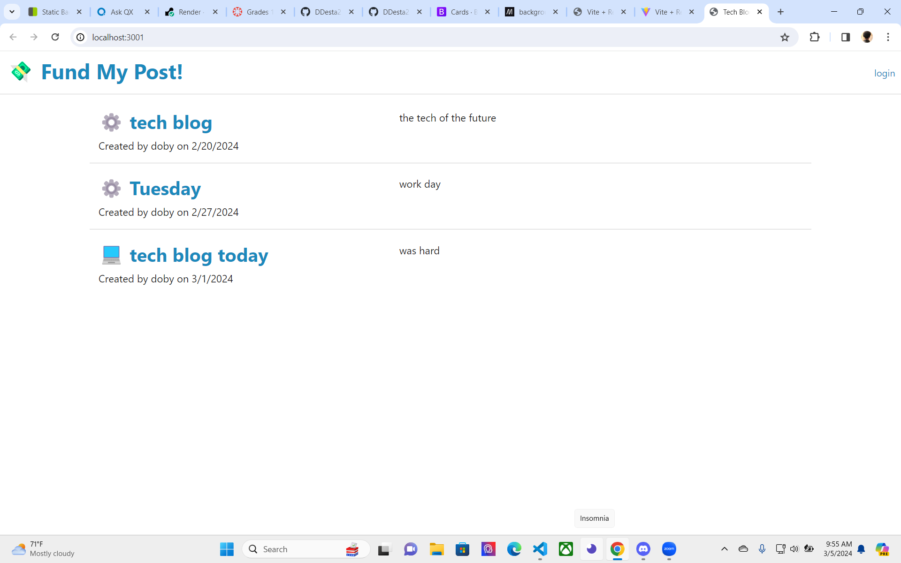
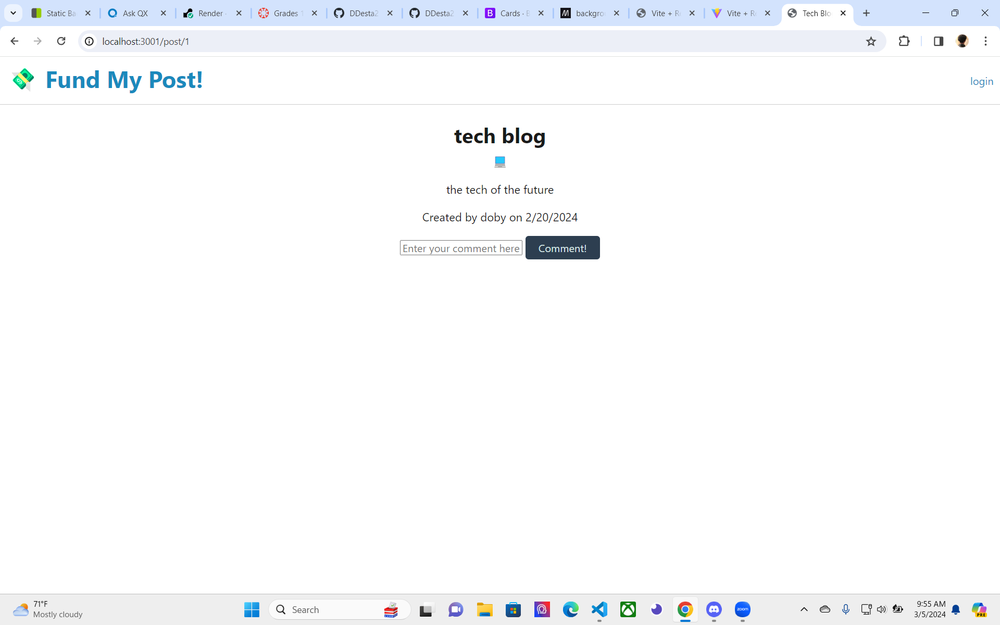
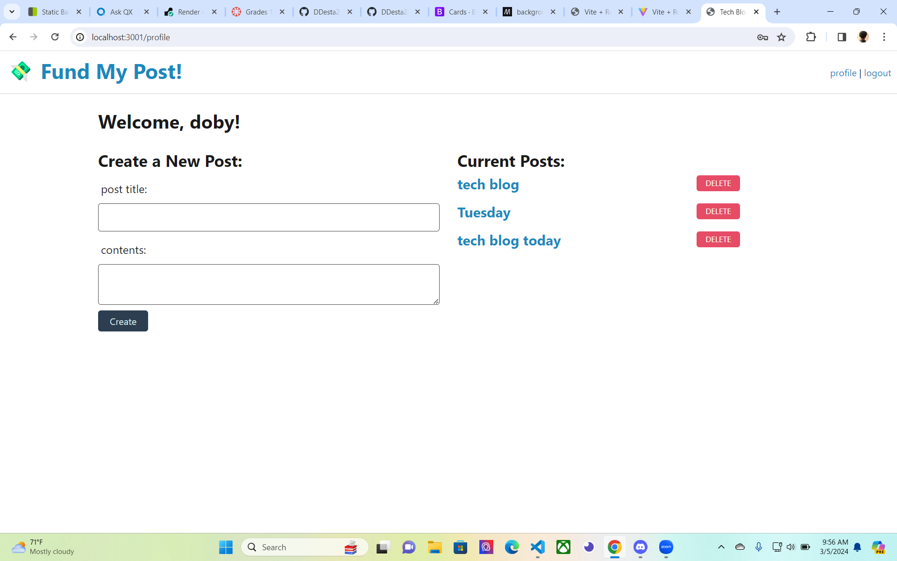

# Tech-Blog

  
    

  ## Description
  
  This project is about creating a CMS-style blog site similar to a Wordpress site, where developers can publish their blog posts and comment on other developers’ posts as well. The app follows the MVC paradigm in its architectural structure, using Handlebars.js as the templating language, Sequelize as the ORM, and the express-session npm package for authentication.
  
  
  
  ## Table of Contents 
  
  
  
  - [Installation](#installation)
  - [Usage](#usage)
  - [Credits](#credits)
  - [License](#license)
  
  ## Installation
  
npm i all dependencies 

## Screen Recording

## Screenshots

  ## Usage
  
  
This application is used to create a CMS-style blog site similar to a Wordpress site, where developers can publish their blog posts and comment on other developers’ posts as well.
  
  
  
  ## Credits
  
  
  
  ## License
  
A short and simple permissive license with conditions only requiring preservation of copyright and license notices. Licensed works, modifications, and larger works may be distributed under different terms and without source code.
  [https://choosealicense.com/licenses/mit/](https://choosealicense.com/licenses/mit/)

  
  ## How to Contribute
  Daniel Desta

tekoladaniel@gmail.com

## Github

DDesta25

  
  
  ## Tests
  npm start

  npm run start
